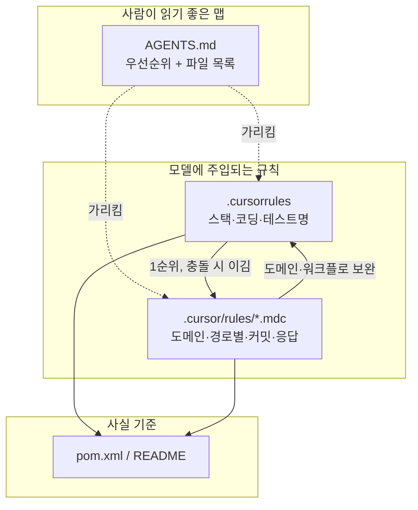
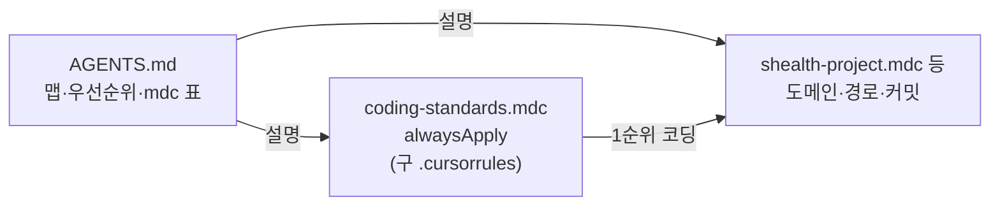

# sciprt 폴더의 스크립트 파일을 활용해서 프롬프트 저장
_Exported on 5/20/2026 at 09:28:55 GMT+9 from Cursor (unknown)_

---

**User**

@.cursorrules.md 을 내가 만들었는데 rules 폴더의 rule 파일들과 비교해서 기존 rules 파일들을 그대로 유지하는게 좋을지? 아니면 삭제해도 되는지? 고쳐서 사용하는게 나을지 판단해줘. 단 @.cursorrules.md 파일을 수정하지 마

---

**Cursor**

`.cursorrules.md`와 `.cursor/rules` 내용을 읽어 비교한 뒤, 유지·삭제·통합 중 어떤 선택이 맞는지 판단하겠습니다.


## 결론

**`.cursor/rules/*.mdc`는 그대로 두는 것이 맞고, 삭제하면 안 됩니다.**  
`.cursorrules.md`는 **단독으로 Cursor에 자동 적용되는 규칙 소스가 아니며**, 내용도 이 프로젝트와 **일부 충돌**합니다. 지금 구조(`.mdc` + `AGENTS.md`)를 유지하고, `.cursorrules.md`에 있는 **일반 코딩 규칙만 골라** `.mdc` 쪽에 반영하는 방향이 가장 낫습니다. (요청대로 `.cursorrules.md` 자체는 수정하지 않습니다.)

---

## 역할 비교

| 구분 | `.cursorrules.md` (10줄) | `.cursor/rules/*.mdc` |
|------|---------------------------|------------------------|
| **적용 방식** | 파일명이 `.cursorrules`가 아니라 **`.cursorrules.md`** → Cursor 기본 규칙 로딩 대상이 **아님** (채팅에서 `@`로 넣거나 수동 참조) | `alwaysApply` / `globs`로 **자동·조건부** 적용 |
| **프로젝트 도메인** | 없음 | `shealth-project.mdc`: BMI·보정·연령대·실습 목표 |
| **리팩토링** | 매직 넘버, 함수 20줄 | `java-refactoring.mdc`: SHealth 스멜·구조·enum 등 **훨씬 구체적** |
| **테스트** | `should_…_when_…`만 | `java-tests.mdc`: 커버리지·fixture·경계값·**한글 메서드명 허용** |
| **커밋·문서** | 없음 | `commit-workflow.mdc`: Report → Prompting → Git |
| **응답 스타일** | 없음 | `response-style.mdc`: 한국어·최소 diff |
| **진입점** | 없음 | `AGENTS.md`가 `.mdc` 사용을 명시 |

`.cursorrules.md`는 **다른 프로젝트용 범용 체크리스트**에 가깝고, 현재 repo는 이미 **SHealth 전용 + 워크플로**로 `.mdc`에 옮겨 둔 상태입니다 (`Report/01_…`, `Prompting/01_…`에도 그 방향이 기록되어 있음).

---

## 충돌·누락 (중요)

1. **Java 버전**  
   - `.cursorrules.md`: **Java 21**  
   - `shealth-project.mdc` + `pom.xml`: **Java 8**  
   → `.cursorrules.md`만 믿으면 AI가 잘못된 전제로 코드를 제안할 수 있습니다.

2. **`.cursorrules.md`에만 있는 규칙** (`.mdc`에 없음)  
   - 모든 `public` 메서드 **Javadoc**  
   - 함수 **최대 20줄**  
   → 가치는 있지만, 실습용 레거시 코드·점진 리팩토링과 **강하게 맞물리지 않을 수** 있음. 넣을 거면 `java-refactoring.mdc` / `java-tests.mdc`에 **완화 문구**(“새 코드·리팩토링한 메서드부터”)와 함께 넣는 편이 안전합니다.

3. **테스트 이름**  
   - `.cursorrules.md`: `should_[결과]_when_[조건]` **만**  
   - `java-tests.mdc`: 위 패턴 **또는** 한글 메서드명 허용  
   → `.mdc`가 이 프로젝트 README·기존 테스트와 더 맞습니다.

4. **매직 넘버·상수**  
   - 둘 다 언급하지만, `.mdc`는 BMI 경계(18.5, 23, 25)와 SHealth 구조까지 포함 → **중복이 아니라 보완** 관계입니다.

---

## 시나리오별 권장

| 선택 | 판단 |
|------|------|
| **`.mdc` 삭제하고 `.cursorrules.md`만 사용** | 비추천. 도메인·커밋 워크플로·조건부 규칙 상실, Java 21 오류, Cursor 자동 적용도 안 됨 |
| **`.mdc` 유지 + `.cursorrules.md` 삭제** | **가능**. 단, Javadoc·20줄 규칙을 원하면 그 전에 `.mdc`에 옮길 것 |
| **`.mdc` 유지 + `.cursorrules.md` 참고용 보관** | **현실적으로 가장 무난**. 개인 메모·다른 프로젝트 템플릿으로 두고, 에이전트는 `AGENTS.md` + `.mdc`만 따르게 함 |
| **`.cursorrules.md` 내용을 `.mdc`에 합치기** | **장기적으로 최선**. 합칠 때는 Java 8·SHealth 도메인 기준으로 정리하고, Javadoc/20줄은 “신규·리팩토링 구간” 정도로 완화 권장 |

---

## 정리

- **기존 rules(`.mdc`)는 삭제하지 말고 유지**하세요. 이 repo의 실제 “운영 규칙”입니다.  
- **`.cursorrules.md`를 고쳐서 `.cursorrules`로 바꾸는 것만으로는** 이미 있는 `.mdc`보다 나아지지 않고, **이중·상충**만 늘어납니다.  
- **`.cursorrules.md`를 “고쳐서 단일 규칙 파일로 쓰기”**보다는, **좋은 항목만 `java-refactoring.mdc` / `java-tests.mdc`에 이식**하는 편이 Cursor 권장 방식과도 맞습니다.  
- 당장 손대지 않을 거면: **에이전트는 `.mdc` + `AGENTS.md`**, `.cursorrules.md`는 **참고·백업**으로 두면 됩니다.

원하시면 (`.cursorrules.md`는 그대로 둔 채) Javadoc·20줄 규칙을 어떤 `.mdc` 문단에 넣을지 초안만 제안해 드리겠습니다.

---

**User**

@.cursorrules.md 의 내용이 더 우선시되어야 해. 이점을 고려해서 다시 판단해줘

---

**Cursor**

`.cursorrules.md`를 최우선 기준으로 두고, `.mdc`와의 충돌 지점을 다시 대조합니다.


## 재판단 (`.cursorrules.md` 최우선)

**`.cursor/rules/*.mdc`는 삭제하지 말고 유지**하되, **내용은 `.cursorrules.md`와 충돌할 때 `.cursorrules.md`가 이기도록 `.mdc`와 `AGENTS.md`를 맞추는 것**이 맞습니다.  
`.mdc`만 두면 지금도 AI 컨텍스트에는 `.mdc`가 더 잘 실리고, `.cursorrules.md`는 파일명 때문에 **자동 적용이 약합니다**. 우선순위를 “의도”로만 두면 **실제로는 `.mdc`가 이기는 구조**라서, 우선순위를 지키려면 **문서 계층을 바꿔야** 합니다.

---

## 우선순위 계층 (권장)

```
1순위: .cursorrules.md  — 코딩·스택·스타일 (항상 이김)
2순위: .cursor/rules/*.mdc — SHealth 도메인·커밋·응답 (1순위와 안 겹치는 부분만)
3순위: pom.xml / README — 빌드·실습 사실 (1순위와 충돌 시 사람이 정리)
```

`AGENTS.md`에는 예를 들어 **「일반 코딩 규칙은 `.cursorrules.md`가 최우선, `.mdc`와 다르면 `.cursorrules.md`를 따른다」** 한 줄이 있어야 합니다. 지금 문구는 “`.mdc`만 쓴다”에 가깝습니다.

---

## 항목별: 지금 `.mdc`와 어긋나는 부분

| `.cursorrules.md` | 현재 `.mdc` | `.cursorrules.md` 우선 시 |
|-------------------|-------------|---------------------------|
| **Java 21** | `shealth-project.mdc`: Java **8** | 규칙 문서·AI 제안은 **21 기준**. `pom.xml`은 아직 8 → **빌드와 규칙 불일치**가 남음. 우선순위를 진짜로 지키려면 `pom.xml`을 21로 올리거나, `.cursorrules.md`에서 8로 맞추는 **사람 쪽 결정**이 필요 (파일은 수정 안 함) |
| 매직 넘버 → 상수 | `java-refactoring.mdc`에도 동일 | **유지·강화** (이미 방향 일치) |
| **모든 public 메서드 Javadoc** | 없음 | `java-refactoring.mdc`에 **필수**로 넣기 |
| **테스트명 `should_…_when_…`만** | `java-tests.mdc`: 한글 메서드명 **허용** | `java-tests.mdc`에서 한글 허용 **삭제**, 예시도 `should_` 패턴으로 통일 |
| **함수 최대 20줄** | 없음 (거대 메서드 리팩토링만 언급) | `java-refactoring.mdc`에 **명시** |
| JUnit 5 + Mockito + Maven | `shealth-project` / `java-tests`와 대체로 일치 | 유지 |
| (없음) | BMI 도메인·보정·연령대·실습 단계 | **`.mdc`에만 있음 → 삭제하면 안 됨** |
| (없음) | `commit-workflow.mdc` | **`.cursorrules.md`에 없음 → `.mdc` 유지** |
| (없음) | `response-style.mdc` | **유지** (충돌 없음) |

정리하면, **삭제 대상은 `.mdc`가 아니라 `.mdc` 안의 상충 문장**입니다.

---

## 시나리오 재평가

| 선택 | `.cursorrules.md` 우선을 반영한 판단 |
|------|--------------------------------------|
| **`.mdc` 삭제, `.cursorrules.md`만** | **비추천**. 도메인·커밋·한국어 응답이 사라지고, 파일명 때문에 자동 로딩도 여전히 약함 |
| **`.mdc` 그대로, `.cursorrules.md` 참고만** | **우선순위 의도와 불일치**. 실무적으로는 `.mdc`가 계속 이김 |
| **`.mdc` 유지 + 상충만 `.cursorrules.md`에 맞게 수정 + `AGENTS.md`에 최우선 선언** | **추천** |
| **`.cursorrules.md`를 `.cursorrules`로 복사·연동** (이름만) | 선택. 자동 적용을 강화하려면 유용. 내용 우선순위와는 별개 |

**.cursorrules.md`를 “고쳐서 단일 파일로만 쓰기”**보다는, **짧은 최우선 규칙은 `.cursorrules.md`에 두고, SHealth·커밋은 `.mdc`에 두되 상충은 제거**하는 **2층 구조**가 `.cursorrules.md` 우선과도 맞습니다.

---

## 반드시 알아둘 한 가지

**Java 21 vs `pom.xml` Java 8**은 규칙 우선순위만으로는 해결되지 않습니다.  
`.cursorrules.md`를 1순위로 두면 AI는 21 문법·API를 쓰고, `mvn test`는 8로 돌아갈 수 있습니다. 다음 중 하나를 골라야 합니다.

1. **`pom.xml`을 21로 올려** 규칙·빌드 일치 (`.cursorrules.md` 우선에 가장 충실)  
2. **`.cursorrules.md`의 21을 8로 바꿈** (빌드 유지, 우선 파일 수정 필요 — 이전에 수정 금지였다면 사용자 결정)  
3. **규칙은 21, 빌드는 8 유지** — 의도적이면 `.mdc`에 “제안은 21, 컴파일 타깃은 pom 따름” 같은 **예외 한 줄**을 넣어 혼선을 줄임 (엄밀히는 2순위 예외)

---

## 최종 권장

1. **`.cursor/rules/*.mdc`는 삭제하지 않는다.** (도메인·커밋·응답·glob 적용)  
2. **`.cursorrules.md`가 이기도록** `shealth-project.mdc`(Java), `java-tests.mdc`(테스트 이름), `java-refactoring.mdc`(Javadoc, 20줄)를 **정렬**한다.  
3. **`AGENTS.md`에 최우선 규칙 파일을 `.cursorrules.md`로 명시**하고, 적용 순서를 적는다.  
4. **`.cursorrules.md`는 개인 “헌법”**, **`.mdc`는 프로젝트 “법률”** — 겹치는 조항은 헌법 wins.  
5. Java 21 우선을 진지하게 쓰려면 **`pom.xml` 정합성**을 다음 작업으로 잡는다.

원하시면 `.cursorrules.md`는 건드리지 않고, 위 세 `.mdc` + `AGENTS.md`에 넣을 **문장 초안(diff 수준)**만 작성해 드리겠습니다.

---

**User**

@.cursorrules 파일명을 이렇게 바꾸면?

---

**Cursor**

`.cursorrules`로 바꾼 뒤 Cursor가 어떻게 인식하는지, `.mdc`와의 관계를 확인합니다.


## `.cursorrules`로 바꾸면?

**파일명 변경 자체는 잘 한 선택입니다.** Cursor가 프로젝트 루트에서 인식하는 **레거시 규칙 파일 이름**이 `.cursorrules`이고, 이전 `.cursorrules.md`는 기본 로딩 대상이 아니었습니다. 지금은 채팅에서 `@` 없이도 **에이전트 컨텍스트에 들어갈 가능성이 훨씬 큽니다.**

내용은 이전과 동일한 10줄(스택·코딩 규칙)이고, `.cursorrules.md`는 repo에 더 이상 없습니다.

---

## `.mdc`와 함께 쓰일 때

| | `.cursorrules` | `.cursor/rules/*.mdc` |
|--|----------------|------------------------|
| 로딩 | 루트 규칙으로 **자동 포함**되는 경우가 많음 | `alwaysApply` / `globs`로 **추가** 적용 |
| 역할 | 당신이 정한 **최우선 코딩·스택 규칙** | SHealth 도메인·커밋·Java/테스트 경로별 규칙 |
| 삭제 여부 | 유지 | **유지** (도메인·커밋은 여기만 있음) |

즉 **`.cursorrules`로 바꾼다고 `.mdc`를 지울 필요는 없습니다.** 둘 다 켜지는 구조가 일반적입니다.

다만 **둘 다 로드되면 상충 구간은 여전히 생깁니다** (예: Java 21 vs `shealth-project.mdc`의 Java 8, 테스트명 `should_…` vs 한글 허용). 파일명만 바꿔서는 “`.cursorrules`가 항상 이긴다”가 보장되지 않고, **문서에 우선순위를 적어 두는 것**이 필요합니다.

---

## 지금 repo에서 어긋나는 점

`AGENTS.md` 3행은 여전히 **「`.mdc`를 쓰고, 레거시 `.cursorrules` 대신」**이라고 되어 있습니다. 실제로는 **`.cursorrules` + `.mdc` 병행**이므로, 에이전트·사람 모두 헷갈릴 수 있습니다.

권장 문구 방향(수정은 원하실 때):

- **1순위**: `.cursorrules` (코딩·스택·스타일)
- **2순위**: `.cursor/rules/*.mdc` (도메인·커밋·응답, 1순위와 충돌 시 `.cursorrules` 우선)
- **3순위**: `pom.xml` / `README` (빌드·실습 사실)

---

## 정리

| 질문 | 답 |
|------|-----|
| `.cursorrules`로 바꿔도 되나? | **예.** 자동 적용·우선 규칙 용도에 맞음 |
| `.mdc` 삭제? | **아니오** |
| 추가로 할 일 | `AGENTS.md` 우선순위 정리, `.mdc` 상충 문장 정렬, Java 21 vs `pom.xml` 8 정합성 |

**파일명 변경 = 올바른 방향**, **규칙 체계 완성 = `AGENTS.md` + `.mdc` 정렬**까지 해야 “`.cursorrules`가 더 우선”이 실제로 맞습니다.

원하시면 `AGENTS.md`와 충돌 나는 `.mdc`만 최소 diff로 맞춰 드리겠습니다.

---

**User**

그래 @.cursorrules 을 기준으로 rules 파일이 다른 부분이 있다면 rules 파일의 내용을 수정해줘

---

**Cursor**

`.cursorrules`를 기준으로 `.mdc`와 `AGENTS.md`의 충돌 부분을 맞춥니다.


`.cursorrules`와 맞추어 아래 파일을 수정했습니다.

## 변경 요약

| 파일 | 수정 내용 |
|------|-----------|
| `shealth-project.mdc` | Java 8 → **Java 21**, JUnit 5 + Mockito 명시, `.cursorrules` 최우선 문구 |
| `java-refactoring.mdc` | Javadoc·20줄·매직 넘버 섹션 추가, `.cursorrules` 우선 참조 |
| `java-tests.mdc` | Mockito 명시, 테스트명 **`should_[결과]_when_[조건]`만** (한글명 제거), 예시 메서드명 변경 |
| `AGENTS.md` | `.cursorrules` 1순위, `.mdc` 2순위 계층으로 재작성 |
| `commit-workflow.mdc` / `response-style.mdc` | `.cursorrules`와 충돌 없음 → **변경 없음** |

## 영향

- AI 제안: Java 21, public Javadoc, 메서드 20줄, 테스트 `should_…_when_…` 기준으로 통일됩니다.
- BMI 도메인·커밋 워크플로·한국어 응답 규칙은 그대로 `.mdc`에 유지됩니다.

## 남은 불일치

`pom.xml`은 아직 **Java 8** (`maven.compiler.source/target`)입니다. 규칙만 21로 맞춰 둔 상태라, 실제 빌드를 맞추려면 `pom.xml`도 21로 올리는 작업이 필요합니다. 원하시면 그다음에 `pom.xml` 수정까지 진행하겠습니다.

---

**User**

pom.xml 도 수정해줘

---

**Cursor**

`pom.xml`을 `.cursorrules`의 Java 21과 맞춰 수정했습니다.

## 변경 내용

- `maven.compiler.source/target` 8 → **`maven.compiler.release` 21** (JDK 21 API 기준으로 컴파일)
- **`project.build.sourceEncoding` UTF-8** 추가

## 빌드 확인

`mvn test`는 **컴파일·실행까지 정상**(JDK 21 사용)이며, 실패 1건은 기존 플레이스홀더 테스트 `SHealthBMITest.failedTest()`의 `fail()` 때문입니다. pom 변경과는 무관합니다.

이제 `.cursorrules` · `.mdc` · `pom.xml`의 Java 버전이 모두 21로 일치합니다.

---

**User**

@AGENTS.md 파을은 왜 만든거지?  @.cursorrules , rules 폴더의 mdc 파일들의 관계에 대해 설명해줘

---

**Cursor**

프로젝트 문서와 규칙 파일을 확인해 `AGENTS.md`의 목적과 세 파일의 관계를 정리합니다.


## `AGENTS.md`는 왜 있나?

이 파일은 **처음 Cursor 규칙·커밋 워크플로를 구성할 때**(Report `01_커서룰-및-커밋-워크플로-구성`) 함께 만든 **에이전트용 “목차·안내서”**입니다.

역할은 다음과 같습니다.

- **규칙 본문을 담지 않음** — BMI 도메인, Javadoc, 커밋 절차 같은 **실제 지시는** `.cursorrules`와 `.mdc`에 있음
- **어떤 파일이 언제 쓰이는지** 한곳에 정리 (표 + 우선순위)
- **사람·AI가 프로젝트에 처음 들어왔을 때** “규칙이 여기저기 흩어져 있으니 이 순서로 보라”는 진입점

Cursor는 Agent 모드에서 `AGENTS.md`를 **프로젝트 가이드**로 읽을 수 있지만, `.cursorrules` / `.mdc`처럼 `alwaysApply`·`globs` 같은 **규칙 엔진 메타데이터**를 갖는 형식은 아닙니다. 그래서 **없어도 규칙 자체는 동작**할 수 있고, **있으면 혼선을 줄이는 인덱스**에 가깝습니다.

---

## 세 가지의 관계 (한눈에)



| | `.cursorrules` | `.cursor/rules/*.mdc` | `AGENTS.md` |
|--|----------------|------------------------|-------------|
| **형식** | 루트 텍스트 (레거시) | YAML frontmatter + Markdown | 일반 Markdown |
| **적용** | 프로젝트 규칙으로 **자동 포함**되는 경우가 많음 | `alwaysApply` / `globs`로 **조건부·항상** 적용 | **설명·인덱스** (규칙 복제 아님) |
| **내용** | Java 21, Javadoc, 20줄, `should_…` 등 **당신의 공통 코딩 헌법** | SHealth BMI·리팩토링·테스트·커밋·한국어 응답 등 **프로젝트 전용** | **우선순위** + “어떤 파일을 보라” |
| **삭제 시** | 공통 코딩 규칙 약화 | 도메인·커밋 절차 상실 | 규칙은 남고, **맵만 사라짐** |

---

## 역할 분담 (비유)

1. **`.cursorrules`** — “우리 팀의 코딩 표준” (모든 Java 작업에 공통)
2. **`.mdc`** — “이 SHealth 과제·이 경로·이 상황(커밋)에서만 추가로 지킬 것”
3. **`AGENTS.md`** — “위 규칙들이 어디 있고, 겹치면 누가 이기는지” 적힌 **안내판**

겹치는 부분(예: Java 21, 테스트 이름)은 **`.cursorrules`가 이기도록** `.mdc`와 `AGENTS.md`를 이미 맞춰 두었습니다.  
`.mdc`에만 있는 것(연령대 BMI, `commit-workflow`의 Report→Prompting→Git)은 **`.cursorrules`에 없으므로 그대로 `.mdc`가 담당**합니다.

---

## Cursor가 실제로 쓰는 흐름

1. 채팅/Agent 시작 → Cursor가 **`.cursorrules`** + **`alwaysApply: true`인 `.mdc`** (`shealth-project`, `response-style` 등)를 컨텍스트에 넣음  
2. **특정 파일 편집** → 해당 `globs`의 `.mdc` 추가 (`java-refactoring.mdc`, `java-tests.mdc`)  
3. **커밋 요청** → `commit-workflow.mdc` (또는 `/commit` 명령)  
4. **`AGENTS.md`** → “규칙이 여러 개니 1→2→3 순서로 보라”는 **메타 정보**로 함께 참고

---

## 정리

- **`AGENTS.md`를 만든 이유**: 규칙 파일이 늘어났을 때 **에이전트·사용자용 한 페이지 인덱스**로, 특히 **우선순위(`.cursorrules` 최우선)** 와 **커밋 시 어떤 `.mdc`를 따를지**를 명확히 하려고.  
- **관계**: `.cursorrules` = 최우선 공통 규칙, `.mdc` = 프로젝트·경로·상황별 규칙, `AGENTS.md` = 둘을 연결하는 **설명서(맵)** — 규칙 본문을 대체하지 않습니다.

`AGENTS.md`를 없애고 싶다면 내용을 README 한 섹션으로 옮겨도 되지만, 그때는 Agent가 규칙 위치를 다시 헤맬 수 있어서 **유지하는 편이 보통 낫습니다.**

---

**User**

@.cursorrules 의 내용을 @AGENTS.md 에 다 옮기고 @.cursorrules 파일을 삭제하고 @AGENTS.md 파일 내에서 rule 폴더의 파일 활용에 대한  내용을 명시하면 되는 것 아니야?

---

**Cursor**

**“AGENTS.md에 다 옮기고 `.cursorrules`만 지우면 된다”**는 구조는 **사람이 읽기엔 깔끔하지만, Cursor가 규칙을 적용하는 방식과는 완전히 같지 않습니다.**

## 왜 “AGENTS.md만”으로는 부족한가

Cursor 쪽에서 역할이 다릅니다.

| 파일 | Cursor가 보는 성격 |
|------|-------------------|
| **`.cursorrules`** | 프로젝트 **규칙**으로 컨텍스트에 넣는 경우가 많음 (레거시지만 여전히 동작) |
| **`.cursor/rules/*.mdc`** | **Project Rules** — `alwaysApply`, `globs`로 **언제 넣을지** 제어 |
| **`AGENTS.md`** | Agent용 **가이드·설명** — “이 프로젝트는 이렇게 일한다”는 문서에 가깝고, `.mdc`만큼 **항상·조건부로 강제**되지는 않을 수 있음 |

그래서 `.cursorrules` 내용을 **AGENTS.md에만** 옮기고 `.cursorrules`를 지우면:

- 표·우선순위·“어떤 mdc를 쓸지” 설명은 잘 됨
- **Java 21, Javadoc, 20줄, `should_…`** 같은 코딩 규칙은 **매 채팅마다 규칙으로 박히지 않을 수 있음** (Agent가 AGENTS.md를 덜 읽거나, 일반 대화에서 빠질 수 있음)

지금은 `.cursorrules`가 **1순위 헌법**인데, 그걸 AGENTS.md만으로 대체하면 **실질적으로는 `alwaysApply` mdc들이 더 세진 구조**가 됩니다.

---

## 하고 싶은 일에 더 가까운 구조

목표가 **“파일 하나 줄이고, AGENTS.md에서 전체를 안내”**라면 이렇게 나누는 편이 낫습니다.

```
AGENTS.md          → 사람·에이전트용 맵 (우선순위, mdc 표, 커밋 안내)
.cursor/rules/
  coding-standards.mdc  (alwaysApply: true)  ← .cursorrules 내용 이전
  shealth-project.mdc
  java-refactoring.mdc
  ...
.cursorrules       → 삭제 OK (내용은 mdc로 이전했을 때)
```

- **`.cursorrules` 삭제**: 가능 (내용을 **`alwaysApply: true`인 `.mdc`로** 옮긴 뒤)
- **내용을 `AGENTS.md`에만**: 비추천 — AGENTS.md는 **맵 + 우선순위 + mdc 활용법**만 두고, **규칙 본문은 `.mdc`**

즉, 질문하신 것 중 **“AGENTS.md에서 rule 폴더 활용을 명시”** → **맞고, 그게 AGENTS.md의 본래 역할**입니다.  
**“`.cursorrules` 내용까지 전부 AGENTS.md로”** → **규칙 강도는 약해질 수 있어서 비추천**입니다.

---

## 권장 관계 (정리)



| 하고 싶은 것 | 권장 |
|--------------|------|
| `.cursorrules` 없애기 | ✅ → `coding-standards.mdc` 등으로 이전 후 삭제 |
| AGENTS.md에 mdc 활용법 적기 | ✅ 지금도 그 방향, 더 보강 가능 |
| 코딩 규칙 전부 AGENTS.md에만 | ❌ 규칙 엔진 관점에서 약함 |
| AGENTS.md = 맵만, 규칙 = mdc | ✅ 가장 Cursor스러운 구성 |

---

## 한 줄 답

**“AGENTS.md에 mdc 쓰는 법을 쓰고 `.cursorrules`는 없앤다”** → **맞는 방향이지만, `.cursorrules` 본문은 AGENTS.md가 아니라 `alwaysApply` `.mdc`로 옮겨야** 지금과 같은 “항상 지키는” 효과에 가깝습니다.  
**AGENTS.md = 안내판, `.mdc` = 실제 규칙, `.cursorrules` = 삭제 가능(이전 후)** 가 정리입니다.

원하시면 `.cursorrules` → `coding-standards.mdc` 이전 + `AGENTS.md` 정리 + `.cursorrules` 삭제까지 한 번에 적용해 드리겠습니다.

---

**User**

그럼 반대로 @AGENTS.md 의 내용을 @.cursorrules 에 옮기면?

---

**Cursor**

**AGENTS.md 내용을 `.cursorrules`로 옮기는 것**은 “가능은 하지만, AGENTS.md만 지우는 것”과는 효과가 다릅니다. 이전에 말한 “규칙 본문을 AGENTS.md에만 두기”보다는 **나은 편**이고, **지금처럼 둘 다 두는 것**과는 트레이드오프가 있습니다.

## 무엇이 달라지나

| | 지금 | AGENTS → `.cursorrules` 후 |
|--|------|---------------------------|
| 코딩 규칙 (Java 21, Javadoc 등) | `.cursorrules` | 그대로 (이미 있음) |
| 우선순위·mdc 표·커밋 한 줄 | `AGENTS.md` | `.cursorrules`에 합침 |
| SHealth 도메인·커밋 상세 | `.mdc` | **그대로 필요** (옮겨도 안 됨) |
| `AGENTS.md` | 있음 | 삭제 가능 |

`.cursorrules`는 Cursor가 **자주, 넓게** 넣는 편이라, AGENTS의 **맵·표**까지 넣으면 **매 턴 토큰**이 늘고, **코딩 규칙 + 프로젝트 안내**가 한 파일에 섞입니다.

---

## 장점

- **한 파일**에서 “표준 + 이 프로젝트 규칙은 어디 있나”를 볼 수 있음  
- AGENTS에만 있던 **우선순위·mdc 표**도 **규칙처럼** 더 잘 실릴 가능성이 있음 (AGENTS만 옮길 때보다 유리)  
- `AGENTS.md` 삭제해도 **진입점**은 루트 `.cursorrules`로 통일 가능  

---

## 단점·주의

1. **자기 참조**  
   AGENTS에 있던 “1순위: `.cursorrules`”를 그대로 붙이면 이상합니다.  
   → “**이 파일의 기술 스택·코드 규칙**이 `.mdc`와 충돌하면 **이 파일 우선**”처럼 고쳐야 합니다.

2. **`.mdc`는 그대로 필요**  
   표만 옮겨도 BMI 도메인·`commit-workflow` 본문·`globs` 적용은 **`.mdc`가 담당**합니다. `.cursorrules` 하나로 통합되지 **않습니다**.

3. **`AGENTS.md` 관례**  
   Cursor·문서·다른 사람은 repo에서 `AGENTS.md`를 먼저 찾는 경우가 많습니다. 없어도 동작은 할 수 있으나 **사람용 발견성**은 줄어듭니다.

4. **파일 비대화**  
   지금 AGENTS는 22줄·`.cursorrules`는 10줄 → 합쳐도 ~30줄 수준이라 **이 프로젝트 규모에서는 실용적**입니다. 나중에 규칙이 늘면 다시 분리하는 게 낫습니다.

5. **중복**  
   표 안의 “`.cursorrules` — Java 21…” 행은 **같은 파일 안**에서는 중복이므로, 표에서는 **`.mdc`만** 나열하는 편이 낫습니다.

---

## “반대로 옮기기” vs “AGENTS에만 옮기기”

| 방향 | 규칙 강도 | 정리 |
|------|-----------|------|
| `.cursorrules` → AGENTS만 | **약해짐** | 비추천 |
| **AGENTS → `.cursorrules`** | 맵도 같이 실림 → **비슷하거나 약간 유리** | 소규모면 OK |
| **둘 다 유지** (역할 분리) | 코딩=rules, 맵=AGENTS | **가장 깔끔** |
| `.cursorrules` → `coding-standards.mdc` + AGENTS만 맵 | Cursor 권장에 가장 가까움 | 파일 수는 많음 |

---

## 한 줄 권장

- **“AGENTS 내용을 `.cursorrules`에 합치고 AGENTS 삭제”** → **이 repo 규모에서는 해도 됨.**  
  다만 **`.mdc` 삭제·대체는 안 됨.**  
- **더 나은 장기 구조**는 여전히  
  - **`.cursorrules`(또는 `coding-standards.mdc`)** = 코딩 헌법  
  - **`AGENTS.md`** = 우선순위 + mdc 표 (짧게)  
  입니다. 합치고 싶다면 **AGENTS → `.cursorrules`가 AGENTS만으로 흡수하는 것보다 낫습니다.**

원하시면 합친 `.cursorrules` 초안(자기 참조 없는 우선순위 문단 + mdc 표)과 `AGENTS.md` 삭제/한 줄 리다이렉트 중 어떤 쪽이 좋을지 정해서 적용해 드리겠습니다.

---

**User**

<cursor_commands>

--- Cursor Command: commit ---
# 커밋 (Report → Prompting → Git)

이 명령은 **커밋 명시 요청**으로 간주합니다. 프로젝트 규칙 `@commit-workflow` 및 `@response-style`을 따릅니다.

**반드시 1 → 2 → 3 순서**로 진행하고, 각 단계가 끝나기 전에 Git 커밋하지 마세요.

## 0. 준비

- `Report/`, `Prompting/` 폴더가 없으면 생성합니다.
- `Report/`에서 `^\d+_.*\.md$` 패턴 파일의 **최대 번호 + 1**을 사용합니다. 없으면 `01`.
- 번호: `01`~`09`는 2자리, `10` 이상은 자연수.
- **작업 title명**: 이번 세션 작업을 한 줄로 요약 (`/\:*?"<>|` → `_`).

## 1. Report 작성

- 경로: `Report/{번호}_{작업 title명}.md`
- 현재 세션에서 수행한 작업을 마크다운 **작업 보고서**로 정리 (고정 템플릿 없음).

## 2. Prompting 저장

- 경로: `Prompting/{번호}_{작업 title명}-Prompting.md` (Report와 **동일 번호·title**)
- `scripts/` Python, JSONL 직접 읽기, `export-cursor-transcript.py` **사용 금지**.
- 이 대화 **전체**를 Cursor **Export Transcript** 형식으로 **직접 작성**:
  - 1행: `# {첫 사용자 메시지 요약 또는 작업 title명}`
  - 2행: `_Exported on M/D/YYYY at HH:MM:SS GMT+9 from Cursor (unknown)_`
  - 턴: `**User**` / `**Cursor**`, 사이 `---`
  - 사용자 본문은 `<user_query>` 없이 원문만
  - **포함**: 모든 사용자·어시스턴트 턴 (요약본만 저장 금지)
  - **제외**: tool, thinking, 시스템·메타 메시지

## 3. Git 커밋

1. `git status`, `git diff`, `git log -5` 로 변경 확인.
2. 스테이징에 **반드시 포함**: 이번 `Report/…md`, `Prompting/…-Prompting.md`, 코드·설정 변경.
3. **제외**: `target/`, `**/__pycache__/`, `*.pyc`, 비밀·자격증명.
4. 커밋 메시지: 1~2문장, **why** 중심 (`feat:`, `docs:`, `chore:` 등). PowerShell: `git commit -m "..."`.
5. `git status`로 완료 확인.
6. **push 하지 않음** (사용자가 별도 요청할 때만).

## 주의

- 업체 제공 스켈레톤·저작권 헤더 파일의 의도치 않은 변경이 섞이면 커밋하지 말고 분리·되돌림을 제안합니다.
- `git config` 변경, `--no-verify`, `push --force` 금지 (사용자 명시 시만 예외).
- 완료 후 사용자에게 Report·Prompting 경로와 커밋 해시(또는 요약)를 한국어로 알립니다.

변경 내용을 모두 커밋해줘
--- End Command ---
</cursor_commands>
<user_query>
/commit 변경 내용을 모두 커밋해줘 
</user_query>

---

**Cursor**

커밋 워크플로(Report → Prompting → Git) 진행. 변경 범위와 Report 번호를 확인합니다.


Report·Prompting 작성 후 커밋합니다.


Prompting에 전체 대화를 반영하도록 보강합니다.


## 커밋 완료

**1 → 2 → 3** 순서로 처리했습니다.

### Report
- `Report/02_cursorrules-기준-규칙-정렬-및-Java21.md`

### Prompting
- `Prompting/02_cursorrules-기준-규칙-정렬-및-Java21-Prompting.md`

### Git
- **커밋**: `2572e78` — `docs: .cursorrules 최우선으로 규칙 정렬 및 pom Java 21 반영`
- **포함**: `.cursorrules`(신규), `shealth-project.mdc`, `java-refactoring.mdc`, `java-tests.mdc`, `AGENTS.md`, `pom.xml`, Report·Prompting 02
- **제외**: `target/`
- **push**: 하지 않음 (`origin/refactoring`보다 1커밋 앞섬)

### 변경 요약
- `.cursorrules`를 최우선으로 `.mdc`·`AGENTS.md` 정렬
- `pom.xml` Java 21 (`maven.compiler.release`)
- 세션 내 AGENTS/`.cursorrules` 통합 논의는 Report·Prompting에 기록 (코드 구조 변경 없음)

---

**User**

sciprt 폴더의 스크립트 파일을 활용해서 프롬프트 저장 파일을 만들어 볼래. 단 파일명은 비교용으로 구분되게 만들어줘. 기존 프롬프팅 파일은 삭제 안하게 조심해. 그리고 하단은 스크립트 파일을 사용한 프롬프르 저장 방법에 대한 설명이야

### 2. 현재 대화 Prompting 저장 (1번 직후, 커밋 전 필수)

- **`scripts/export-cursor-transcript.py`** 로 **지금 이 대화창**에 해당하는 JSONL만 읽어 Export Transcript 형식 MD로 저장합니다.
- **저장**: `Prompting/{번호}_{작업 title명}-Prompting.md` (1번과 동일 `{번호}_{작업 title명}`).

**현재 대화 JSONL 식별 (필수)**

- **금지**: `--project-slug` 만으로 “가장 최근” JSONL을 고르지 않습니다 (다른 채팅이 선택될 수 있음).
- **우선**: Cursor가 제공하는 **현재 대화 ID** →  
  `~/.cursor/projects/e-DEV-GildedRose-04/agent-transcripts/<id>/<id>.jsonl`
- **보조**: 위 ID를 모르면 `agent-transcripts` 아래 JSONL을 검색해 **이번 세션의 사용자 메시지·주제**와 일치하는 파일을 찾습니다.
- **불가 시**: 사용자에게 대화 ID 또는 확인을 요청합니다. 잘못된 JSONL로 export 후 커밋하지 않습니다.

```bash
python scripts/export-cursor-transcript.py --conversation-id <현재-대화-uuid> \
  -o Prompting/{번호}_{작업title}-Prompting.md

---

**Cursor**

스크립트와 대화 JSONL 위치를 확인한 뒤, 비교용 파일명으로 export합니다.

