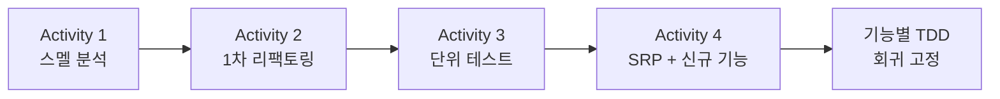
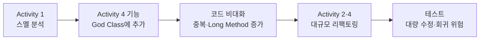

# 개발 순서: 리팩토링 vs 신규 기능 — 영향 정리

| 항목 | 내용 |
|------|------|
| 프로젝트 | SHealth BMI (`e:\DEV\SHealth_04`) |
| 작성 일자 | 2026-05-20 |
| 목적 | 실제 진행 순서 정리 및 **「기능 먼저 → 리팩토링 나중」** 가정 시 차이 분석 |
| 관련 문서 | [code-smell-analysis.md](./code-smell-analysis.md) (리팩토링 전), [code-smell-analysis-after-refactoring.md](./code-smell-analysis-after-refactoring.md) (리팩토링 후) |

---

## 1. 요약

본 프로젝트는 README Activities와 커밋 이력상 **코드 스멜 분석 → 1차 리팩토링 → 단위 테스트 → SRP 분리와 신규 기능** 순으로 진행했다.

**「신규 기능을 먼저 넣고 나중에 리팩토링했다면?」** 에 대한 답:

- 리팩토링을 **끝까지** 잘 했다면 **최종 아키텍처는 비슷해질 수 있음**
- 그러나 **중간 코드 품질·리팩토링 난이도·테스트 부담·스멜 규모**는 **현재보다 나빠졌을 가능성이 큼**
- 실습 README가 2·3을 4보다 앞에 둔 이유와도 일치한다

---

## 2. 실제 진행 순서 (우리가 한 일)

### 2.1 README Activities

| 단계 | 내용 | 성격 |
|------|------|------|
| **1** | 문제 코드 분석·코드 스멜 찾기 | 분석 |
| **2** | 1차 리팩토링 (네이밍, 하드코드, 함수 추출, 중복 제거) | **리팩토링** |
| **3** | UnitTest (BMI·보정·분류·예외) | **테스트** |
| **4** | SRP 분리 + 연령대 비율·키 보정·정상 BMI 목록·전체 비율 | **리팩토링 + 신규 기능** |

Activity 4는 이름은 「기능 개선」이지만, 항목에 **SRP 책임 분리**와 **Height 보정·조회 API**가 함께 포함된다.  
즉 **「기능만」이 아니라 「구조 정리와 기능」이 한 단계**에 묶여 있다.

### 2.2 Git 커밋 흐름 (요약)

| 순서 | 커밋 메시지 (요지) | 단계 |
|------|-------------------|------|
| 1 | docs: Activity 1 코드 스멜 분석 | 1 |
| 2 | refactor: Activity 2 1차 리팩토링, BMI 분류 버그 수정 | 2 |
| 3 | test: Activity 3 단위 테스트 보강 | 3 |
| 4 | refactor: Activity 4 SRP 분리 및 키 보정·조회 API 추가 | 4 |
| 5~ | test: 연령대 비율·키 보정·정상 목록·전체 비율 TDD | 4 검증 |

**한 줄 정리:** 거대한 `SHealth`를 **먼저** 정리(2→3)한 뒤, 클래스를 나누면서 **신규 기능을 붙임**(4).

### 2.3 문서와 코드의 대응

| 문서 | 시점 |
|------|------|
| [code-smell-analysis.md](./code-smell-analysis.md) | 리팩토링 **전** — God Class, Long Method, 24분기 등 |
| [code-smell-analysis-after-refactoring.md](./code-smell-analysis-after-refactoring.md) | SRP 분리 **후** — 잔여 Duplicated Code 등 |

---

## 3. 가정: 신규 기능 먼저 → 리팩토링 나중

### 3.1 가정 시나리오

Activity 4 항목을 **리팩토링 전 단일 `SHealth`** 에 먼저 구현했다고 가정한다.

- `height == 0` 연령대 평균 키 보정
- BMI 정상 범위 사용자 목록 조회
- 전체 사용자 대비 BMI 범주별 비율
- (기존) 연령대별 BMI 분포 비율 강화

그 다음 Activity 2·4 수준의 리팩토링을 수행한다.

### 3.2 예상되는 차이

| 관점 | 기능 먼저 (가정) | 실제 순서 (리팩토링·테스트 후 기능) |
|------|------------------|-------------------------------------|
| **`SHealth` 크기** | 200줄 → **300줄 이상**으로 비대화 가능 | Facade ~81줄, 책임 분산 |
| **`calculateBmi`** | 로드·체중·**키**·BMI·연령대·**전체 비율**이 한 메서드에 누적 | ~7줄 오케스트레이션 |
| **중복** | `weight==0` 옆에 `height==0` **복붙** 가능성 큼 | `WeightImputer` / `HeightImputer` 대칭 분리 |
| **God Class** | 조회 API까지 한 클래스에 집중 후 **더 큰 덩어리**를 분해 | 분리 후 기능 추가 |
| **Long Method** | 20줄 제한 **초과 지속** | 메인 소스 20줄 이내 |
| **테스트** | 거대 API에 맞춘 TC → 리팩토링 시 **대량 수정** | 작은 단위·fixture로 회귀 고정 |
| **도메인 버그** | BMI=25 미분류를 새 분기에서 **재발** 여지 | `BmiClassifier` 단일 진입점 |
| **리팩토링 동기** | 「돌아가니까」 부분 정리로 **미완료** 위험 | 스멜 분석·Activity 2로 동기 확보 |
| **잔여 스멜 (최종)** | Imputer·비율 집계 중복 **+ α** 가능 | Imputer·`toPercentRatios` 중복 위주 |

### 3.3 최종 결과는 같을까?

| 질문 | 답 |
|------|-----|
| SRP까지 **완전히** 리팩토링했다면 최종 구조? | `Facade + Loader + Imputer + Classifier + Statistics + Query` — **비슷하게 도달 가능** |
| 중간 산출물·작업 비용? | **다름** — 스멜 표·커밋·테스트·회귀 범위가 더 무거웠을 것 |
| 실습에서 README 순서? | **2·3 → 4** 가 「읽을 수 있는 코드 + TC」 후 기능 확장과 맞음 |

---

## 4. 비교 다이어그램

### 4.1 실제 순서 (권장 흐름)

### 4.2 가정 순서 (기능 선행)

### 4.3 비유

| 순서 | 비유 |
|------|------|
| **실제** | 빈 방 정리(1차 리팩토링) → 배선·검사(테스트) → 방 나누기 + 새 가구(SRP + 기능) |
| **가정** | 가구부터 가득 → 나중에 벽·배선 정리 → **이사·손상 비용** 증가 |

---

## 5. Activity 4를 나눠 보면

Activity 4 한 커밋 안에서는 **리팩토링과 기능 추가가 동시**에 일어났다.

| 구분 | 예시 |
|------|------|
| 리팩토링 | `CsvHealthRecordLoader`, `BmiClassifier`, `AgeDecadeStatistics`, `SHealth` Facade |
| 신규 기능 | `HeightImputer`, `getNormalBmiUserIds`, `getOverallRatio` |

**전체 프로젝트 타임라인**으로는 여전히 **2·3이 4보다 앞**이므로,  
「리팩토링(및 테스트)을 어느 정도 한 뒤 기능을 확장했다」고 보는 것이 맞다.

---

## 6. 회고·발표(Activity 5)에 쓸 포인트

1. **Before:** `code-smell-analysis.md` — God Class, 99줄 `calculateBmi`, BMI=25 버그  
2. **After:** `code-smell-analysis-after-refactoring.md` — 높음 스멜 해소, 잔여 중복  
3. **순서의 가치:** 기능을 먼저 넣지 않아 **Height 보정을 Imputer 패턴으로** 맞추기 쉬웠음  
4. **한계:** Activity 4에서 SRP와 기능이 한 번에 들어가 커밋 단위는 크다 — 다음에는 기능별 커밋 분리도 고려  
5. **가정 질문:** 기능 선행 시 **최종 목표지는 비슷해도 경로 비용이 커진다**

---

## 7. 참고

- [README.md](../README.md) — Activities 1~5  
- [AGENTS.md](../AGENTS.md) — 도메인·리팩토링 규칙  
- `.cursor/rules/java-refactoring.mdc` — 20줄·SRP·매직 넘버

---

*본 문서는 실습 회고·발표용으로, 채팅에서 정리한 「개발 순서와 가정 비교」 내용을 docs로 옮긴 것이다.*
